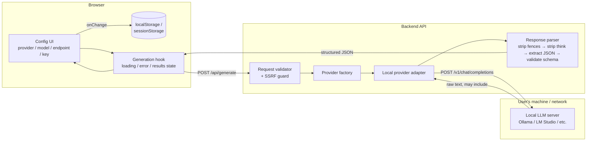
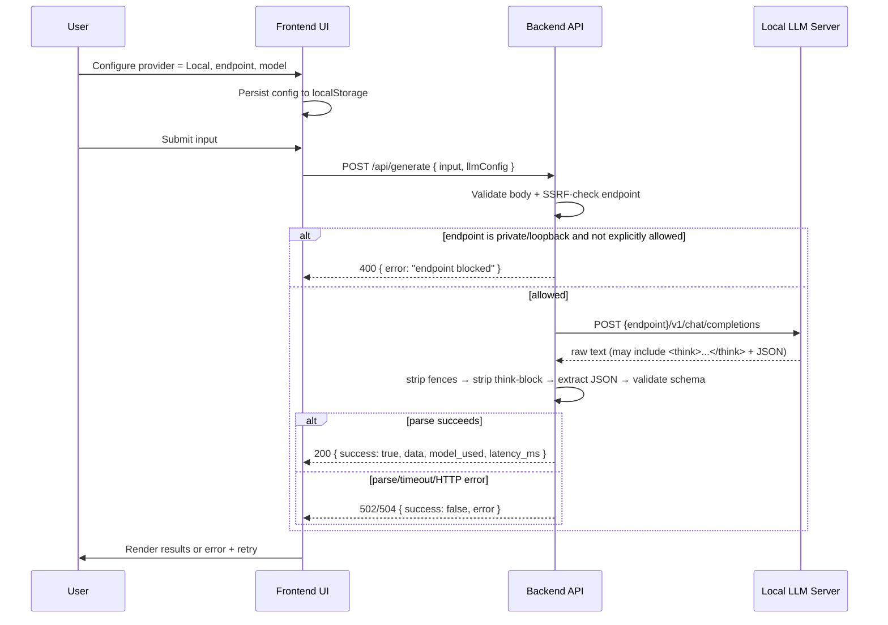

# Local LLM Integration — Architecture & Implementation Guide

A portable reference for wiring a web app's frontend + backend to a **local, OpenAI-compatible LLM server** (Ollama, LM Studio, LocalAI, text-generation-webui, vLLM's OpenAI shim, etc.), including robust parsing of structured (JSON) output from reasoning models. Extracted from a working implementation; provider names are generic so this can be dropped into any React/Node-style stack (or ported to another language 1:1).

---

## 1. Why this needs its own design

Calling a **local** LLM from a web app differs from calling a cloud API in three ways that drive most of the architecture below:

1. **The endpoint is user-supplied and untrusted** — it points at `localhost`/private IPs by definition, which is exactly what SSRF protections normally block. You have to deliberately allow it, safely.
2. **The server behind that endpoint is a moving target** — Ollama, LM Studio, LocalAI, etc. each have quirks (slightly different request shape, whether they honor the `system` role, whether the model name in the request even matters).
3. **Reasoning models leak their scratchpad** — models like DeepSeek-R1, QwQ, gpt-oss, etc. emit a chain-of-thought before the real answer, often wrapped in `<think>...</think>`. If you need structured JSON back, you must parse around this or your JSON.parse will fail intermittently in a way that's hard to reproduce.

---

## 2. High-level architecture



**Key principle:** the browser never talks to the local LLM server directly. Everything is proxied through your own backend. This is what makes the SSRF guard and API-key masking possible, and it means CORS on the local LLM server is a non-issue.

---

## 3. End-to-end user flow

1. User opens the app, picks **Provider = Local LLM** in a config panel.
2. User enters (or accepts defaults for):
   - **Endpoint** — e.g. `http://localhost:11434` (Ollama) or `http://localhost:1234` (LM Studio)
   - **Model name** — optional; empty means "let the server decide" (useful for LM Studio, which serves whatever's currently loaded)
   - **API key** — optional; most local servers don't require one, some do
   - **Advanced toggles** (see §5.3): whether to append the standard path suffix, whether to merge system+user into one message
3. Config is persisted client-side (so it survives a page reload) and echoed back up to the parent component on every change.
4. User pastes their input and clicks Generate.
5. Frontend hook sets `loading = true`, POSTs the full payload (input + options + llm config) to the backend, and awaits.
6. Backend validates the payload, including running the SSRF check against the user-supplied endpoint.
7. Backend instantiates a **local provider adapter** and calls the local server's chat-completions endpoint.
8. Backend receives raw text back, strips markdown fences and any reasoning-model scratchpad, extracts and validates the JSON payload.
9. Backend returns a normalized JSON envelope (`success`, structured data, `provider_used`, `model_used`, `latency_ms`).
10. Frontend sets `loading = false` and renders results, or renders an error banner with a **Retry** action (frontend keeps the last request in a ref so retry doesn't require re-entering everything).



---

## 4. Frontend implementation

### 4.1 Config component responsibilities

A single component owns all provider/model/endpoint/key state and exposes one thing to the rest of the app: a normalized config object via an `onChange` callback. Responsibilities:

- Maintain provider selection (cloud vs. local vs. others) as a toggle.
- Maintain a **preset model list per provider** plus an "enter custom model name" escape hatch (local servers frequently run models not in any preset list).
- For the local provider specifically, expose:
  - `endpoint` (text/URL input, with inline hints for common defaults)
  - `apiKey` (optional, `type="password"`, `autoComplete="off"`)
  - `appendPath` (boolean) — whether to suffix the endpoint with the standard chat-completions path, vs. treat the endpoint as the full URL already
  - `mergePromptsToUser` (boolean) — see §5.2, needed for models/servers that ignore the `system` role
- Persist the whole panel's state to `localStorage` on every change, and rehydrate from it on mount, so users don't re-configure every session.
- Emit only the **effective** config on change (e.g., omit `apiKey` from the emitted object entirely if blank, rather than emitting an empty string).

### 4.2 Generation hook responsibilities

A single hook owns `loading` / `error` / `results` state and the fetch call, decoupled from any specific component:

- `generate(payload)` — sets `loading = true`, clears prior error, calls the API, and on success/failure updates `results`/`error` accordingly. Stores the payload in a ref so it can be replayed.
- `retry()` — replays the last stored payload without requiring the caller to reconstruct it.
- Distinguish **network failure** (fetch rejected — server unreachable) from **application-level failure** (fetch resolved, `success: false` in the body) — both should surface a user-readable message, but they're different failure classes worth logging differently.

### 4.3 What NOT to do on the frontend

- Don't call the local LLM server directly from the browser (`fetch('http://localhost:11434/...')`). It bypasses the SSRF guard, leaks the endpoint/key to browser network tab clarity aside, and requires the local server to have CORS configured for your origin, which most don't.
- Don't persist the API key to `localStorage` if you can avoid it — prefer `sessionStorage` (cleared on tab close) or, better, don't persist it client-side at all and require re-entry. `localStorage` is plaintext, readable by any script (including via XSS), and has no expiry. See §8.

---

## 5. Backend implementation

### 5.1 Request validation + SSRF guard

Any time a backend accepts a **user-supplied URL** and is about to make an outbound request to it, that's an SSRF vector — even though in this case the "attacker" is often just your own user pointing at their own machine. Validate in this order:

1. **Shape checks** — is `endpoint` present, is it a syntactically valid URL, is the protocol `http:`/`https:` only (reject `file:`, `gopher:`, etc.)?
2. **Private/loopback hostname check** — maintain a pattern list and reject unless explicitly allowed:
   ```
   127.0.0.0/8, 10.0.0.0/8, 172.16.0.0/12, 192.168.0.0/16,
   169.254.0.0/16 (link-local — also covers cloud metadata endpoints, e.g. 169.254.169.254),
   0.0.0.0, ::1, fc00::/7, fe80::/10, "localhost"
   ```
3. **Explicit opt-in via server-side config flag** (e.g. `ALLOW_LOCAL_ENDPOINTS=true`), never a client-supplied flag — the decision to permit local targets belongs to whoever runs the backend (dev machine = yes, production multi-tenant SaaS = almost certainly no), not to whoever fills out the form.
4. Validate everything else generically: input length caps, allowed enum values for provider/model/categories, body size limits at the framework level (e.g. Express's `express.json({ limit: '32kb' })`), and per-IP + global rate limiting on the generation endpoint specifically (it's your most expensive route).

### 5.2 Provider adapter pattern

Use a **factory + common interface** so the rest of the backend never branches on provider name:

```
getProvider(name, config) -> { provider: string, model: string, generate({systemPrompt, userPrompt}) -> {text, model, latency_ms} }
```

Each concrete adapter (cloud provider A, cloud provider B, local) implements `generate()` the same way: build request body → fire with a timeout via `AbortController` → on non-2xx, throw with status + truncated body → on success, extract the assistant's text + normalize latency. This means the route handler is provider-agnostic and adding a fourth provider later touches only the factory + one new adapter file.

**Local adapter specifics:**
- **Configurable path suffix** — some setups want you to POST to `{endpoint}/v1/chat/completions`; others (reverse-proxied, or endpoint already includes the path) want the endpoint used as-is. Expose this as a boolean rather than hardcoding.
- **Optional model field** — if the user leaves model blank, omit `model` from the request body entirely rather than sending `null`/`""`; let the local server pick its currently-loaded model. Read back whatever model name the server reports in its response, since it may differ from what was requested.
- **Longer timeout than cloud providers** — local models frequently need to cold-load into memory/VRAM on first request. A cloud-appropriate timeout (~30s) will false-fail here; use something like 60s+ for local.
- **`mergePromptsToUser` escape hatch** — some local models/templates don't respect the `system` role at all (system prompt gets silently dropped). Offer a toggle to concatenate system+user into a single `user` message as a fallback, defaulting to standard multi-message behavior.
- **Optional bearer token** — only attach an `Authorization` header if a key was actually provided; don't send an empty/placeholder header.

### 5.3 API key handling (server side)

- Never log a raw key. Mask it everywhere it might hit stdout/stderr: show only first 4 + last 4 characters (`sk-a***3f21`), and only if the key is long enough that doing so doesn't just reveal the whole thing.
- Prefer environment-configured keys for your own default cloud providers (never sent to/from the browser at all); accept a **per-request override** only for cases where the user is explicitly bringing their own endpoint/key (i.e., the local provider, or a BYOK cloud flow) — see the companion secrets-management notes below if this needs to scale to a multi-tenant vault-backed setup.

---

## 6. Parsing LLM output into structured data

This is the part that silently breaks once you point at more "creative" local models, so it deserves its own section.

### 6.1 The problem

You ask the model for JSON. Compliant models return exactly JSON. Many models — especially local/open-weight ones — instead return one or more of:

- The JSON wrapped in a markdown code fence (```` ```json ... ``` ````)
- Prose before and/or after the JSON ("Sure, here's the test cases you asked for: { ... } Let me know if you need more!")
- For **reasoning models**: a full chain-of-thought that itself contains a *draft* JSON blob mid-narrative, followed by a closing marker (commonly `</think>`, sometimes `<|end_of_thought|>` or similar depending on the model/template), followed by the *real* final JSON.

A naive "find the first `{` and the last `}` in the whole string" parser works for the simple cases but **breaks on the reasoning-model case**, because the first `{` lands inside the draft blob and the last `}` lands at the end of the real answer — everything in between (including prose like "let me double check the constraints...") gets swept into the string you try to `JSON.parse`, which fails with something like `Unexpected non-whitespace character after JSON at position N`.

### 6.2 The parsing pipeline (apply in this order)

1. **Strip markdown fences** — regex off a leading ` ```json ` / ` ``` ` and a trailing ` ``` `, case-insensitive, tolerant of surrounding whitespace.
2. **Strip reasoning scratchpad** — if the text contains a closing think-tag (check for all variants your target models might use: `</think>`, `</reasoning>`, `<|end_of_thought|>`), **discard everything up to and including the *last* occurrence** and continue with only what's after it. This must happen *before* brace-extraction, and must use the **last** occurrence (not first) in case the draft blob inside the reasoning also happens to contain the literal substring.
3. **Extract the JSON object** — now that scratchpad/drafts are gone, find the first `{` and last `}` in the remaining text and slice between them. This still tolerates a stray "Here's your JSON:" preamble or trailing "Let me know if that works!" from non-reasoning models that just aren't perfectly compliant.
4. **Parse** — `JSON.parse` the slice. Catch and rethrow with a truncated preview of the input (first ~400 chars) attached to the error message — you will need this for debugging live model behavior, and you don't want to dump an entire multi-KB response into your error logs/UI.
5. **Validate the shape** — don't trust that valid JSON means *correctly-shaped* JSON. Explicitly check: the expected root key exists and is the right type (e.g., an array); every item has every required field and it's not `null`/`undefined`; array-typed fields are actually arrays. Fail with a specific, itemized message (`item[2] is missing required field "priority"`) rather than a generic "invalid response" — this is the difference between a debuggable prompt-engineering iteration loop and a black box.

### 6.3 Defense in depth (optional, for flaky local models)

If step 3's "first `{` / last `}`" still occasionally spans multiple JSON-like blocks (e.g., a model that repeats itself, or a think-tag variant you didn't anticipate), a more robust fallback is to **scan backward from the end of the string doing brace-depth counting** to find the last *self-contained* top-level `{...}` object, and attempt to parse candidates from the end of the string backward until one succeeds — rather than assuming the first-to-last span is always one contiguous object.

### 6.4 Even better: suppress the scratchpad at the source

If your local server/model supports it, prefer **not having to parse around the scratchpad at all**:
- Some inference servers expose a param like `reasoning_format: "hidden"` or a `reasoning_effort` setting that keeps the chain-of-thought out of the `content` field entirely (may appear in a separate `reasoning` field instead, which you simply don't read).
- Failing that, a strong closing instruction in your prompt ("Return ONLY the JSON object. No markdown, no explanation, no reasoning.") reduces — but does not reliably eliminate — scratchpad leakage on models that were fine-tuned to always think out loud. Treat the parsing pipeline above as required, not optional, even with a strict prompt.

---

## 7. Error handling contract

Normalize every failure mode into one shape (`{ success: false, error: "..." }`) with an appropriate HTTP status, so the frontend needs exactly one branch:

| Failure | Status | Notes |
|---|---|---|
| Request body fails validation (bad input, disallowed provider, blocked endpoint) | 400 | Return all validation errors joined, not just the first |
| Local server unreachable / non-2xx response | 502 | Include the upstream status + truncated body in the message |
| Local server didn't respond within timeout | 504 | Distinguish from generic network errors — check `err.name === 'AbortError'` |
| Response received but not parseable / wrong shape | 502 | This is an upstream contract violation, not a client error — 502 (bad gateway) is more accurate than 400 |

---

## 8. Security checklist for a production port of this

- [ ] SSRF guard on any user-suppliable endpoint, with the local-endpoint allowance gated by a **server-owned** env flag, never a client-owned one.
- [ ] Rate limit the generation endpoint specifically (it's your costliest route) in addition to a global limit.
- [ ] Cap request body size and input string length at the framework level.
- [ ] Mask API keys in every log line; never log full raw model output at `info` level in production (it may contain user-submitted sensitive text) — gate verbose raw-output logging behind a debug flag.
- [ ] Prefer `sessionStorage` over `localStorage` for any client-held API key, or avoid persisting it client-side entirely.
- [ ] If this evolves into multi-tenant BYOK (users bringing their own cloud keys, stored server-side), don't roll your own — use envelope encryption via a KMS/vault (CyberArk, AWS Secrets Manager, HashiCorp Vault) and gate it behind real per-user authentication; a static `.env` value is fine for a single operator's own default key, not for storing other people's keys.
- [ ] Add a strict CSP (`script-src 'self'`, no `unsafe-inline`) — XSS is the actual precondition for exfiltrating anything you do end up storing client-side.

---

## 9. Minimal file layout to replicate this

```
backend/
  routes/generate.<ext>          # validate → provider factory → call → parse → respond
  validators/generateRequest.<ext>  # shape checks + SSRF guard
  services/llm/
    getProvider.<ext>            # factory: name -> adapter
    providers/
      local.<ext>                # endpoint/model/appendPath/mergePromptsToUser/timeout
      <cloud-provider-a>.<ext>
      <cloud-provider-b>.<ext>
    prompts/systemPrompt.<ext>    # shared system prompt + few-shot examples

frontend/
  components/
    LLMConfigPanel.<ext>         # provider/model/endpoint/key UI, localStorage persistence
    ResultsPanel.<ext>
    ErrorBanner.<ext>             # error + retry
  hooks/
    useGenerator.<ext>            # loading/error/results + generate()/retry()
  api/
    generate.<ext>                 # thin fetch wrapper to the backend endpoint
```

This layout keeps the "provider-agnostic route + swappable adapter" separation intact, which is the piece most worth preserving if you're porting into a different stack — everything else (React vs. another framework, Express vs. another server) is incidental detail.
