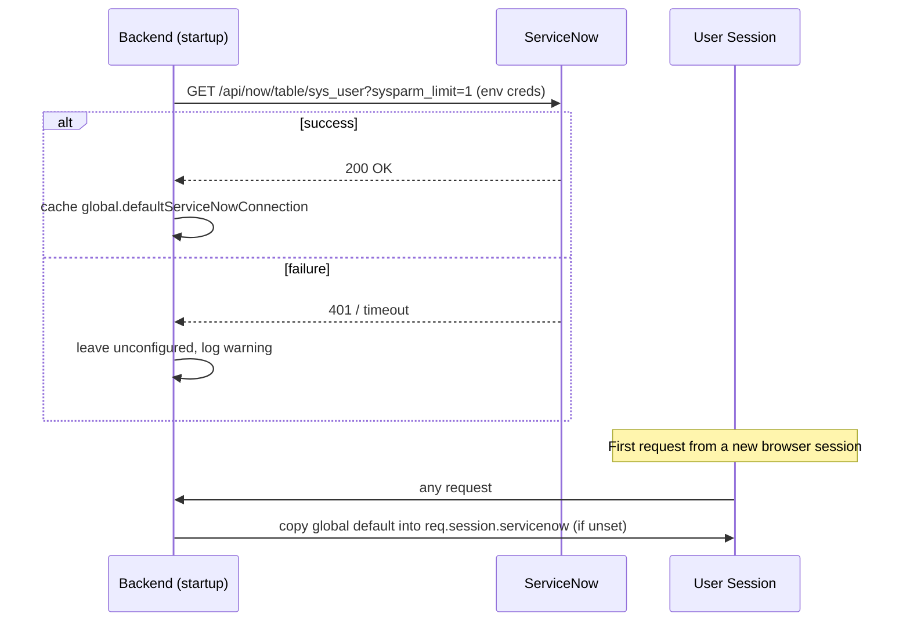
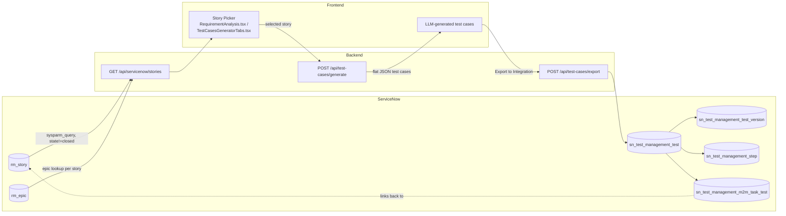
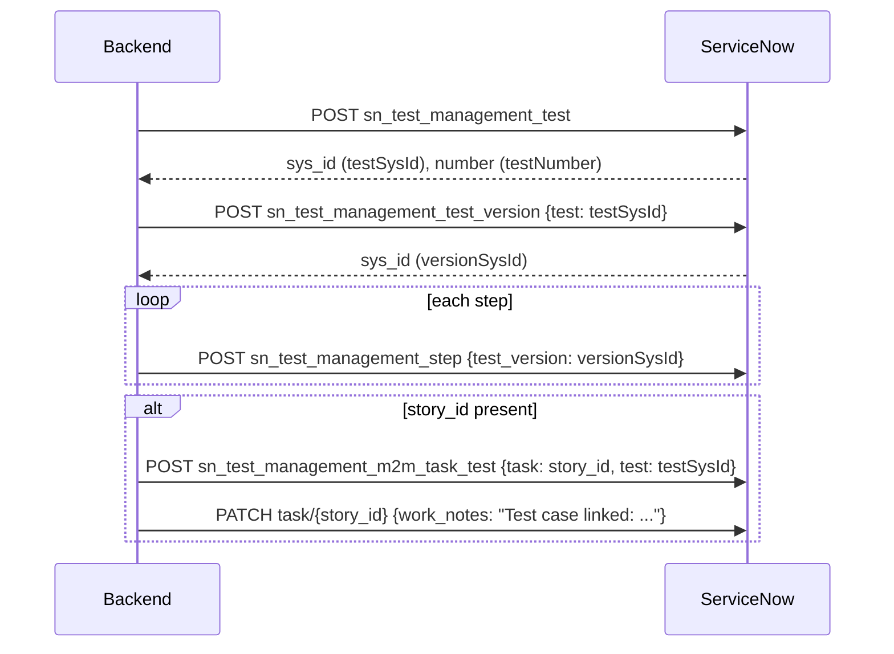
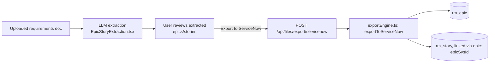

# ServiceNow Integration

Technical reference for how R-Automation Test Management connects to ServiceNow, pulls requirements, and pushes generated test cases and extracted epics/stories back into it.

## 1. Overview

ServiceNow is one of two supported requirement sources (the other is Jira). The integration covers three independent flows:

1. **Pull** user stories from ServiceNow's `rm_story` table to drive test case generation.
2. **Push** AI-generated test cases into ServiceNow's Test Management 2.0 tables.
3. **Push** AI-extracted epics/stories (from uploaded requirement documents) into `rm_epic`/`rm_story`.

All three share one authenticated session; there is no separate login per flow.

## 2. Authentication & Connection

 `instanceUrl/oauth_token.do` with authtype as Basic Auth and provide User Name as  `Client Id` + and password as `Client SecretId` and in response take the access_token value and use for following calls with servicenow.

### Manual connect

`POST /api/servicenow/connect` — [server.ts:330](../backend/src/server.ts)

Request:
```json
{ "instanceUrl": "https://your-instance.service-now.com/oauth_token.do", "username": "Client Id", "password": "Clinet secret ID" } and store the Access token.
```

The backend validates the URL, then probes `GET {instanceUrl}/api/now/table/sys_user?sysparm_limit=1` to confirm the credentials actually work. On success it stores the **raw credentials in the server-side session** (`req.session.servicenow = { instanceUrl, username, password }`) and returns:
```json
{ "success": true, "message": "Connected to ServiceNow successfully", "recordCount": 1 }
```

Credentials never round-trip back to the browser after that — only a boolean "connected" status does.

### Auto-connect on backend startup

[connectionManager.ts:92-152](../backend/src/services/connectionManager.ts) (`initializeServiceNow`) reads `SERVICENOW_API_ENDPOINT` / `SERVICENOW_USERNAME` / `SERVICENOW_PASSWORD` (or their `VITE_`-prefixed equivalents) at process start. If all three are present, it runs the same `sys_user` probe and, on success, caches the credentials in a process-global (`(global as any).defaultServiceNowConnection`).

A request middleware ([server.ts:82-87](../backend/src/server.ts)) then copies that global default into any new session that doesn't already have `req.session.servicenow` set — so once the env vars are configured, every user of the app is auto-connected without ever hitting the Settings tab.



## 3. Configuration

| Variable | Used by | Purpose |
|---|---|---|
| `SERVICENOW_API_ENDPOINT` / `VITE_SERVICENOW_API_ENDPOINT` | backend auto-connect, frontend fallback | Instance base URL |
| `SERVICENOW_USERNAME` / `VITE_SERVICENOW_USERNAME` | backend auto-connect, frontend fallback | Basic auth username |
| `SERVICENOW_PASSWORD` / `VITE_SERVICENOW_PASSWORD` | backend auto-connect, frontend fallback | Basic auth password |
| `DEFAULT_INTEGRATION` | backend | `jira` or `servicenow` — which source `/api/config` advertises as default, and which one the story-picker UI queries when no explicit choice is made |

Frontend reads these as a display/fallback fallback via `getIntegrationConfigFromEnv()` / `isServiceNowConfigured()` in [integrationConfig.ts:36-77](../frontend/src/config/integrationConfig.ts), but the source of truth for whether ServiceNow is actually usable is always `GET /api/config`:

```json
{
  "integrations": {
    "defaultIntegration": "jira",
    "jiraConfigured": true,
    "serviceNowConfigured": false
  }
}
```
([server.ts:120-134](../backend/src/server.ts)) — `serviceNowConfigured` reflects the connection manager's global state, not necessarily the requesting browser's own session.

There is currently **no UI toggle to explicitly pick ServiceNow over Jira** per generation — `DEFAULT_INTEGRATION` is the single switch, read by both `RequirementAnalysis.tsx` and `TestCasesGeneratorTabs.tsx` via `fetchDefaultIntegrationStories()` ([integrationService.ts:112-127](../frontend/src/services/integrationService.ts)).

## 4. Workflow: Pull Stories → Generate Test Cases → Export



### 4.1 Pulling stories

`GET /api/servicenow/stories` — [server.ts:406-521](../backend/src/server.ts)

Queries `rm_story` directly:
```
GET {instanceUrl}/api/now/table/rm_story
    ?sysparm_limit=50
    &sysparm_query=state!=7^ORDERBYDESCsys_created_on   (default: excludes "Closed")
    &sysparm_fields=sys_id,number,short_description,description,state,priority,acceptance_criteria,epic
```
For any story with an `epic` reference, a second lookup against `rm_epic` resolves the epic's number/title. `state`/`priority` codes are mapped to human labels ([server.ts:442-458](../backend/src/server.ts)) before the normalized `Story[]` (with `source: 'servicenow'`) is returned to the frontend via `fetchServiceNowStories()` in [integrationService.ts:66-90](../frontend/src/services/integrationService.ts).

Unlike Jira (which uses JQL against a free-form issue search), ServiceNow story fetching is hardcoded to the `rm_story`/`rm_epic` tables — there's no query customization exposed in the UI.

### 4.2 Generating test cases

Test case generation itself is **integration-agnostic** — the same `POST /api/test-cases/generate` endpoint and flat JSON schema (`{ test_cases: [{ name, short_description, description, test_type, priority, state, version, steps }] }`) is used regardless of whether the source story came from Jira or ServiceNow. See `LOCAL_LLM_IMPLEMENTATION.md` / the main test-case generation docs for the LLM call itself.

### 4.3 Exporting test cases to ServiceNow

`POST /api/test-cases/export` with `{ testCases, integration: 'servicenow', storyKey }` — shared route at [server.ts:1695](../backend/src/server.ts), ServiceNow branch at [server.ts:1844-2016](../backend/src/server.ts). Called from `TestCasesGeneratorTabs.tsx` (`exportToIntegration` / `exportSingleTestCase`).

Each test case in the payload is a flat object shaped like:
```json
{
  "id": "gen-1234-0",
  "name": "Verify user can log in with valid credentials",
  "description": "...",
  "short_description": "...",
  "test_type": "Positive",
  "priority": "High",
  "state": "draft",
  "version": "1.0",
  "story_id": "STRY0010047",
  "steps": [
    { "order": 100, "step": "...", "expected_result": "...", "test_data": "..." }
  ]
}
```

The backend loops over `testCases` and, **per test case**, makes up to 5 sequential API calls to build a chain of real ServiceNow Test Management 2.0 records, each referencing the `sys_id` returned by the previous call:



If any call for a given test case throws, that test case is recorded in `results.failed` (with the upstream error message) and the loop **continues to the next test case** — a single failure doesn't abort the batch. The response reports `{ success, created: [...], failed: [...], summary: { total, created, failed } }`.

#### Field mapping

| Target table | Target field | Source | Notes |
|---|---|---|---|
| `sn_test_management_test` | `short_description` | `testCase.name` | |
| | `description` | `testCase.description \|\| testCase.short_description \|\| ''` | |
| | `test_type` | `testCase.test_type \|\| 'manual'` | **Passed through raw — no enum mapping.** The generation prompt produces `"Positive"` / `"Negative"` / `"End to End"` / `"Edge Cases"` ([server.ts:519](../backend/src/server.ts)), which get written verbatim into ServiceNow's `test_type` field. If that field is a choice list on the target instance rather than a free string, these values won't match any choice and ServiceNow will likely reject or silently blank the field. |
| | `priority` | `mapPriorityToServiceNow(testCase.priority)` | Critical→`1`, High→`2`, Medium→`3`, Low→`4`, unrecognized→`3` ([server.ts:2026-2034](../backend/src/server.ts)) |
| | `state` | hardcoded `'draft'` | `testCase.state` (also usually `"draft"` from generation) is **not read** — the export always writes `'draft'` regardless of what the UI shows. |
| `sn_test_management_test_version` | `test` | `testSysId` (from step 1 response) | |
| | `version` | `testCase.version \|\| '1.0'` | |
| | `short_description` | `testCase.name` | |
| | `description` | `testCase.description \|\| testCase.short_description \|\| ''` | |
| | `state` | hardcoded `'draft'` | same caveat as above |
| | `priority` | `mapPriorityToServiceNow(testCase.priority)` | recomputed, same mapping |
| `sn_test_management_step` (one row per step) | `test_version` | `versionSysId` (from step 2 response) | |
| | `order` | `step.order \|\| (index + 1) * 100` | |
| | `step` | `step.step \|\| ''` | |
| | `expected_result` | `step.expected_result \|\| ''` | |
| | `test_data` | `step.test_data \|\| ''` | |
| `sn_test_management_m2m_task_test` | `task` | `testCase.story_id` | See caveat below — this is not actually a `sys_id`. |
| | `test` | `testSysId` | |
| `task/{story_id}` (PATCH) | `work_notes` | `` `Test case linked: [${testNumber}] ${testCase.name}` `` | Best-effort; failure here only logs a warning, doesn't fail the export |

This is a materially richer export than the Jira path, which creates generic `Task`/`Story`/`Epic` issues rather than purpose-built test-management records.

#### ⚠️ Known issue: `story_id` is a display number, not a `sys_id`

`testCase.story_id` is populated in the frontend as `selectedStory?.key` ([TestCasesGeneratorTabs.tsx:263, 377, 530, 610](../frontend/src/components/TestCasesGeneratorTabs.tsx)). For a ServiceNow-sourced story, `key` is set to `story.number` — e.g. `"STRY0010047"` — **not** `story.sys_id` ([server.ts:492-493](../backend/src/server.ts)):
```js
return {
  id: story.sys_id,     // the real sys_id
  key: story.number,     // the human-readable display number — this is what ends up as story_id
  ...
};
```
That display number is then sent as-is into two places that ServiceNow's Table API expects a real `sys_id` for: the `task` reference field on `sn_test_management_m2m_task_test`, and the `task/{story_id}` PATCH URL path. On a real instance, both calls will most likely fail (wrong sys_id / 404), silently — the linking step is wrapped in its own `try/catch` that only logs a warning ([server.ts:1979-1981](../backend/src/server.ts)) and doesn't fail the overall export. **Net effect: the test case, version, and steps are created correctly, but the story↔test-case link and work-note are unlikely to actually attach on ServiceNow.** This works by coincidence for Jira, where `key` (the issue key, e.g. `PROJ-123`) is itself a valid identifier Jira's API accepts in place of a numeric ID — ServiceNow has no equivalent affordance. Fixing this would mean threading `story.sys_id` (not `story.number`) through as `story_id` for the ServiceNow path specifically.

## 5. Workflow: Epic/Story Extraction → Push to ServiceNow

A second, independent flow lets a user upload a requirements document, have the LLM extract epics/stories from it, and push the results into ServiceNow — unrelated to test-case export.



`EpicStoryExtraction.tsx` → `exportToServiceNow()` in [epicStoryService.ts:211-221](../frontend/src/services/epicStoryService.ts) → `POST /api/files/export/servicenow` ([fileUploadRoutes.ts:396-458](../backend/src/routes/fileUploadRoutes.ts)) → [exportEngine.ts:193-341](../backend/src/lib/exportEngine.ts), which creates an `rm_epic` row first, then child `rm_story` rows referencing it.

## 6. Error Handling

`connectServiceNow()` ([integrationService.ts:165-191](../frontend/src/services/integrationService.ts)) never throws on an HTTP error response — it parses the JSON error body and resolves `{ success: false, message }`. UI `catch` blocks (`Settings.tsx`, `App.tsx`) are effectively only reachable for network-level failures (DNS, connection refused), not for ServiceNow rejecting bad credentials.

Backend status codes from `/api/servicenow/connect` and `/api/servicenow/stories`:

| Condition | Status | Message |
|---|---|---|
| Missing `instanceUrl`/`username`/`password` | 400 | field validation message |
| Malformed instance URL | 400 | URL format error |
| Bad credentials | 401 | `"ServiceNow authentication failed. Check username and password."` |
| Request timeout | 504 | timeout message |
| Host unreachable | 400 | connection error |
| Other | 500 | `"ServiceNow error: {message}"` |

Live error text like `401 "User is not authenticated"` is ServiceNow's own `error.response.data.error.message`, passed through verbatim — not generated by this codebase.

## 7. Known Issues

### 7.1 Orphaned nested test-case format

There is a **second, unused code path** for ServiceNow test-case generation that should not be relied on:

- `POST /api/test-cases/generate-servicenow` ([server.ts:983-1109](../backend/src/server.ts)) generates a *nested* JSON shape — `{ test_cases: [{ testData, versionData, stepsData }] }` — instead of the flat shape used everywhere else. It maps 1:1 onto the same `sn_test_management_*` tables, just field-grouped differently.
- Its only frontend caller is `TestCasesGenerator.tsx` (`generateServiceNowTestCases`, `handleSendToServiceNow`) — but **`TestCasesGenerator.tsx` is not imported anywhere in the app** (`App.tsx` renders `TestCasesGeneratorTabs`, a different component). Confirmed via repo-wide import search.
- Its "Send to ServiceNow" button is additionally a non-functional stub (`console.log` + a toast, no API call).

Net effect: every real ServiceNow test-case export today goes through the **flat** format and the shared `/api/test-cases/export` route (§4.3). The nested `generate-servicenow` endpoint and its UI are dead code — flagged here rather than removed, since decommissioning them is a separate cleanup decision.

### 7.2 `story_id` sent to ServiceNow is a display number, not a `sys_id`

Covered in detail in §4.3. Summary: the story-linking step (`sn_test_management_m2m_task_test` + the `task/{story_id}` work-note PATCH) receives `story.number` (e.g. `"STRY0010047"`) instead of `story.sys_id`, because the frontend reuses the same `selectedStory.key` field that works correctly for Jira. The test case, version, and steps themselves are created fine; only the link back to the originating story is likely to silently fail on a real instance.

## 8. Summary: ServiceNow vs. Jira Asymmetries

| Aspect | Jira | ServiceNow |
|---|---|---|
| Auth | Email + API token | Username + password (Basic Auth) |
| Story source | JQL search (`rest/api/3/search`) | Fixed `rm_story`/`rm_epic` tables |
| Test case generation format | Flat only | Flat (live) + orphaned nested variant |
| Export target | Generic `Task`/`Story`/`Epic` issues | Purpose-built Test Management 2.0 records (`sn_test_management_*`) with story linkage |
| Source selection | Single `DEFAULT_INTEGRATION` env var, no per-request UI toggle | Same |
